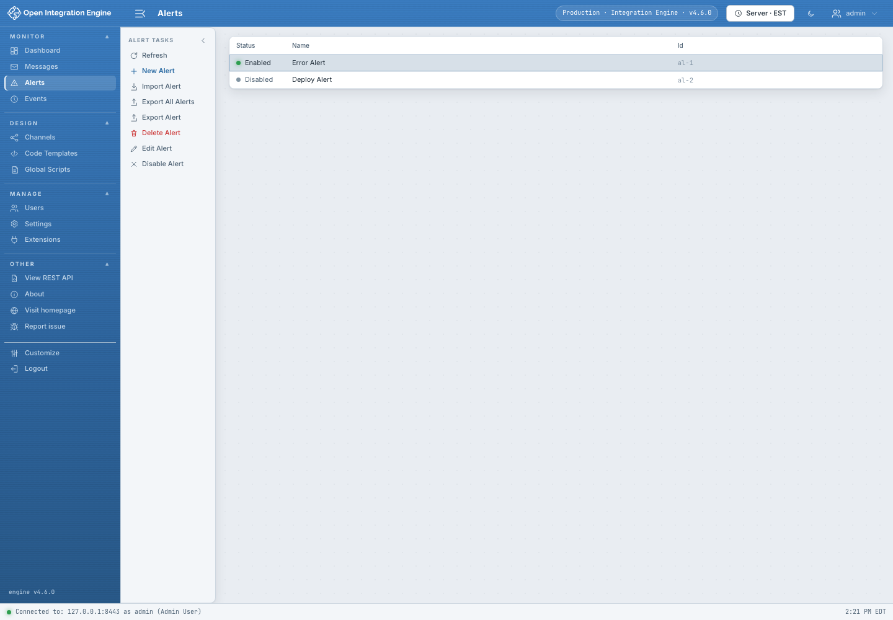
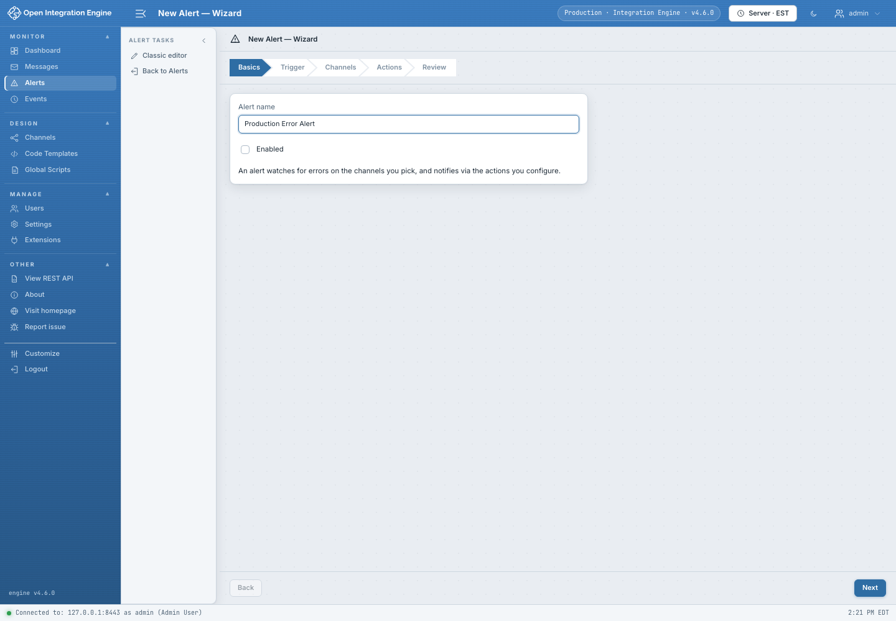
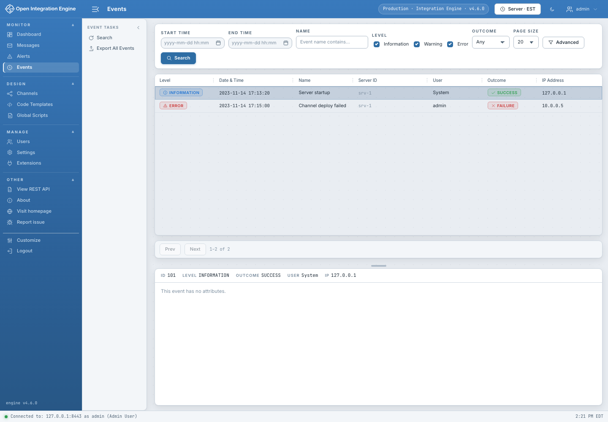

# Alerts and Events

## Alerts

Alerts watch engine or channel conditions and run configured actions.

The list shows enabled and disabled alerts. Select a row to Edit, Enable,
Disable, Export, or Delete it. Import resolves identity/name collisions before
dispatching writes.

### Guided alert wizard

The wizard walks through:

1. **Basics** — name and enabled state.
2. **Trigger** — error types, channels, regex, and other trigger criteria.
3. **Actions** — email, script, or other available first-party actions.
4. **Review** — confirm the exact alert before Create/Save.

The classic editor exposes the same model in a single detailed form. Use the
wizard when creating a normal alert and the classic editor when you need direct
control over every field.

Alert saves perform an action-time conflict check. If the initial alert could
not be loaded or a revalidation request fails, do not assume it is safe to
overwrite.

## Events

Events are the engine audit and operational history.

- Filter by date, level, outcome, name/type, user, server, and text.
- Select an event to open its complete attributes and identifiers.
- Page through large result sets or export the authorized result set.
- Use the title-bar timezone control to interpret timestamps consistently.

Review Events after deployments, configuration changes, user changes, message
exports/removals, extension changes, and failed multi-step operations.

