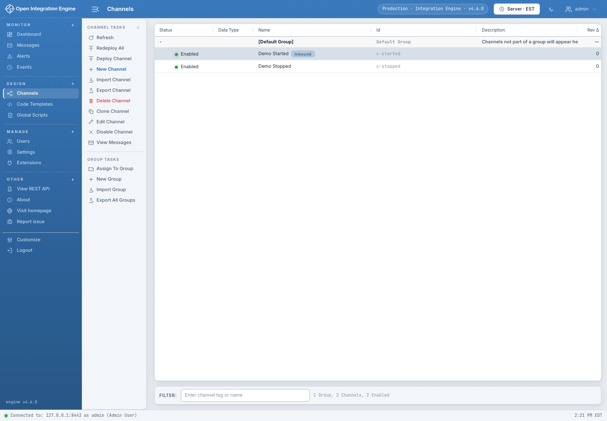

# Channels

The Channels screen is the design inventory for channels and channel groups.

## What the list shows

- Channel name, group, enabled state, revision, and deployment information.
- Channel and group selection with a task pane and matching context menus.
- A bottom filter for quickly narrowing large inventories.

## Create a channel

Choose **New Channel**, then select:

- **Wizard** for a guided Basics → Dependencies → Channel Options → Source →
  Destinations → Scripts → Review flow.
- **Classic editor** for the full tabbed editor immediately.

The default can be changed under **Settings → Administrator** while retaining
the chooser when “Ask each time” is selected.

## Organize channels

- Create, rename, and delete channel groups.
- Assign or drag channels between groups.
- Use tags for cross-group operational classification.
- Clone a channel when a new design should start from an existing definition.

Group changes replace a shared server-side set. Refresh before editing and
resolve any conflict warning instead of overwriting another administrator’s
newer group changes.

## Import and export

Channel import accepts exported XML and prompts when names or IDs collide. The
workflow can also bring code-template libraries, dependencies, and group
membership when present. Review every collision decision before the first
write; a cancel during preparation should result in no import.

After a partial or network-ambiguous import, reconcile the server inventory
before retrying. Re-importing an ID-less or partially committed package can
otherwise create duplicates.

Export preserves the engine model, including unknown extension fields. Store
exports securely because channel definitions can contain endpoints, scripts,
credentials, and operational metadata.

## Deploy and redeploy

Select one or more channels and choose Deploy/Redeploy. Deployment may involve
dependencies, so inspect the target list and resulting status. A timeout does
not prove that the engine rejected the operation; refresh and verify state
before retrying.

See [Channel Editors](Channel-Editors.md) for design details.

