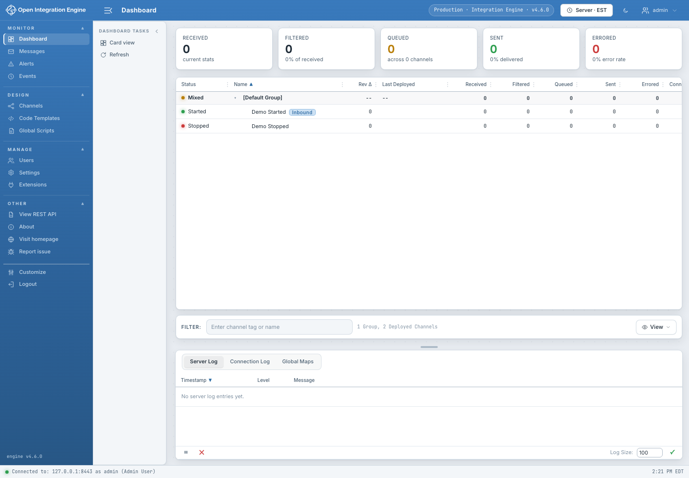

# OIE Web Client Wiki

OIE Web Client is a browser-based administrator for Open Integration Engine
(OIE/Mirth Connect). It provides monitoring, channel design, message search,
alerting, audit-event review, server configuration, and extension management
without requiring the Swing Administrator.

## Start here

- [Getting Started](Getting-Started.md) — install, connect, sign in, and learn
  the shell.
- [Dashboard](Dashboard.md) — monitor channel state and control deployments.
- [Channels](Channels.md) — organize, import, export, deploy, and edit channels.
- [Channel Editors](Channel-Editors.md) — classic editor, guided wizard, filters,
  transformers, scripts, and data types.
- [Messages](Messages.md) — search, inspect, export, reprocess, and remove data.
- [Alerts and Events](Alerts-and-Events.md) — alert definitions and audit history.
- [Code Templates and Global Scripts](Code-Templates-and-Global-Scripts.md) —
  reusable JavaScript and lifecycle hooks.
- [Users and Extensions](Users-and-Extensions.md) — user administration and
  first-party extension inventory.
- [Settings](Settings.md) — server, administrator, tags, configuration map,
  database tasks, resources, and Data Pruner settings.
- [Operations and Safety](Operations-and-Safety.md) — safe production workflows,
  partial failures, confirmation prompts, and auditing.
- [Deployment and Configuration](Deployment-and-Configuration.md) — Node,
  Docker, WAR, TLS, and configuration precedence.
- [Troubleshooting](Troubleshooting.md) — common startup, connectivity, browser,
  and feature-availability problems.

## Documentation scope

This Wiki covers the web administrator and first-party OIE functionality. It
does not include third-party plugin screens such as Sentinel, TLS Manager,
Thread Viewer, RBAC, or Source Code Search. Installed extensions can add tabs,
tasks, columns, editors, or routes that are not shown here.

All screenshots are generated against mocked sample data. Names, counts, server
versions, and timestamps are illustrative; no production data or PHI is used.

