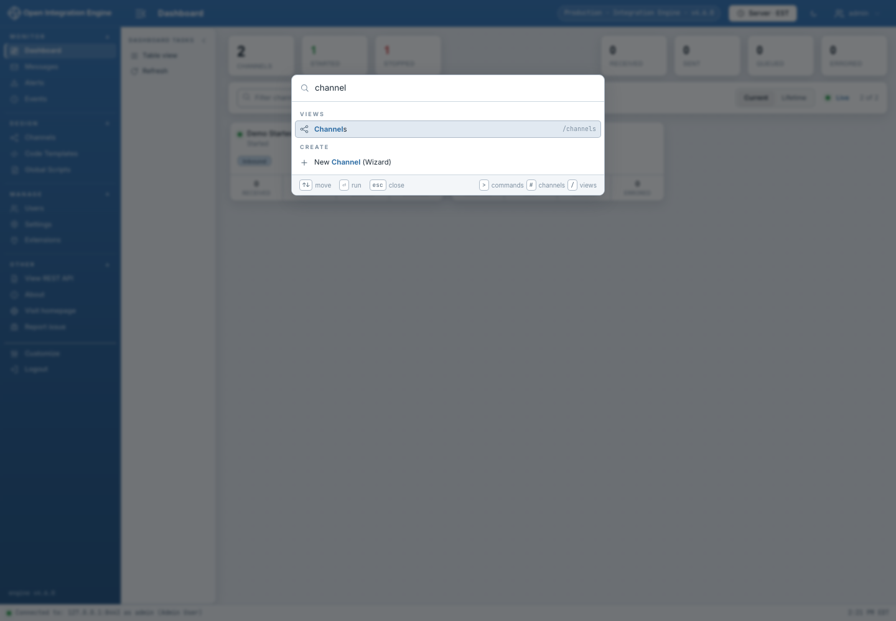

# Interface Tour

The authenticated shell has five persistent regions:

1. **Navigation rail** — Monitor, Design, Manage, and Other sections.
2. **Title bar** — current screen, environment identity, timezone, theme, and
   account menu.
3. **Task pane** — actions for the current view or selection.
4. **Main workspace** — the active list, form, editor, or detail view.
5. **Status bar** — engine connection, authenticated user, and local time.

The navigation and task panes can be collapsed. **Customize** changes visible
navigation items and ordering without changing authorization.

The account menu provides Change Password and session actions. The **Other**
section opens the engine REST API documentation, About/build information,
project homepage, and issue-reporting link. About is the quickest way to record
the client version, commit, build date, deployment mode, and engine version when
reporting a problem.

## Command palette

Press **Ctrl+K** or **⌘K** to search registered views, channels, and commands.

Useful search prefixes:

- `/` limits results to views.
- `#` limits results to channels.
- `>` limits results to commands.

The palette uses the same registry and task checks as the navigation rail; it
does not bypass hidden or unauthorized actions.

## Selection-driven tasks

Most list screens show only safe, always-available tasks until you select a row.
Selection reveals actions such as Edit, Export, Enable, Deploy, or Delete. Right
clicking a row opens the same action family in a context menu.

## Theme, fonts, density, and timezone

- Use the sun/moon title-bar button for the saved light/dark theme.
- Choose Server, Local, or UTC time from the title-bar timezone control.
- Set table density, UI font, and data font under **Settings → Administrator**.
- Review pending preference changes in the live preview before saving.

The data font applies to tables, message payloads, identifiers, and code-like
content; the UI font applies to navigation, labels, forms, and buttons.
